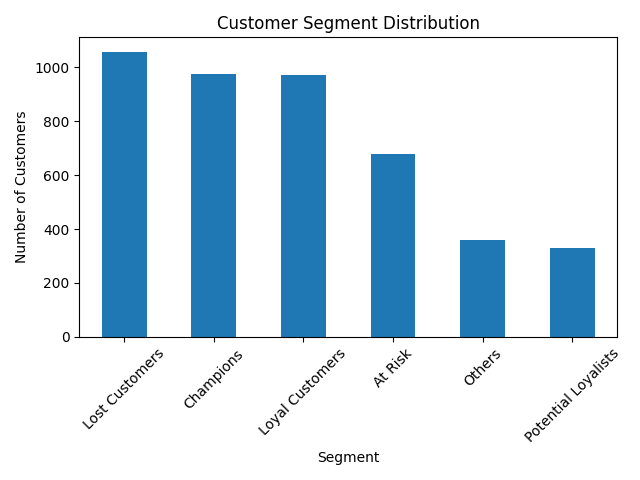
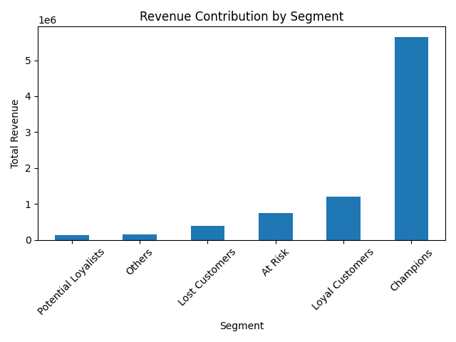

# 🛍️ Customer Segmentation Using RFM Analysis

## 📌 Project Overview

This project performs **RFM (Recency, Frequency, Monetary) Analysis** on retail transaction data to segment customers and generate actionable business insights.

---

## 🎯 Objectives

* Analyze customer purchase behavior
* Segment customers based on RFM metrics
* Identify high-value and at-risk customers
* Provide data-driven business recommendations

---

## 📊 Dataset

* Source: Online Retail Dataset
* Contains transactional data including:

  * Customer ID
  * Invoice Date
  * Quantity
  * Unit Price

---

## 🧱 Project Workflow

### 1️⃣ Data Cleaning

* Removed missing Customer IDs
* Filtered out returns (negative quantity)
* Converted date columns
* Created Total Revenue column

---

### 2️⃣ RFM Calculation

* Recency → Days since last purchase
* Frequency → Number of transactions
* Monetary → Total spending

---

### 3️⃣ Customer Segmentation

Customers were grouped into:

* 🟢 Champions
* 🟡 Loyal Customers
* 🔵 Potential Loyalists
* 🔴 At Risk
* ⚫ Lost Customers

---

### 4️⃣ Key Insights

* A small percentage of customers generate the majority of revenue
* Many customers fall into "At Risk" and "Lost" categories
* Customer retention is a major opportunity for growth

---

### 5️⃣ Business Recommendations

* Reward high-value customers (Champions)
* Target at-risk customers with retention campaigns
* Improve engagement for potential loyalists

---

## 📈 Visualizations

### Customer Segment Distribution



### Revenue by Segment



---

## 🛠️ Tools & Technologies

* Python (Pandas, Matplotlib)
* SQL
* Power BI

---

## 🚀 How to Run

1. Clone the repository
2. Install dependencies:

   ```bash
   pip install -r requirements.txt
   ```
3. Run Jupyter notebooks

---

## 💡 Future Improvements

* Add K-Means clustering
* Build interactive dashboard
* Implement customer lifetime value (CLV)

---

## 👤 Author

Your Name
